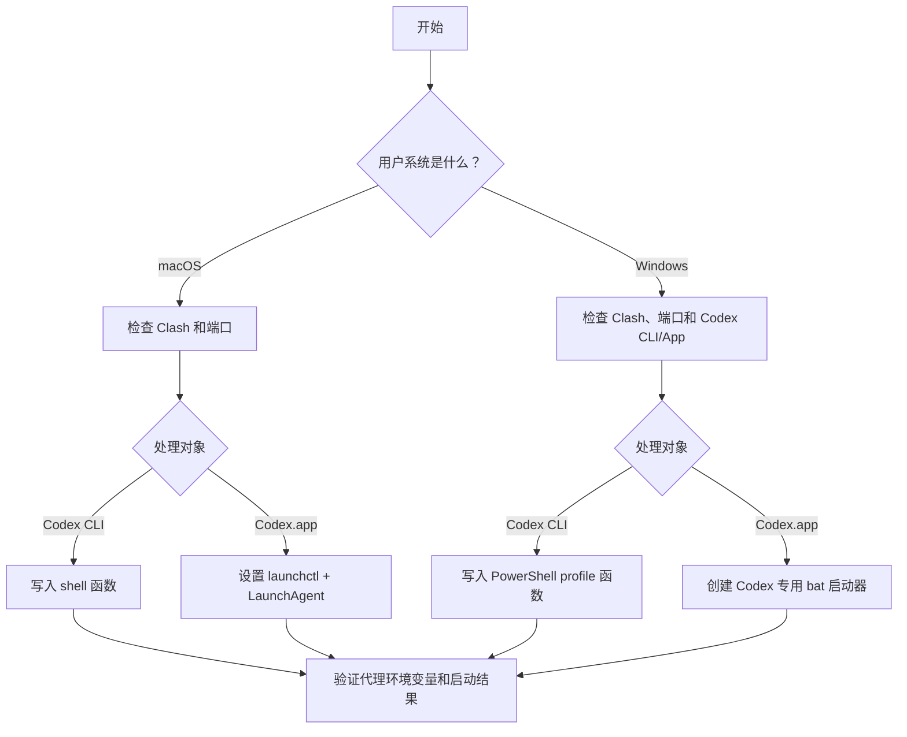

# 在 macOS 和 Windows 里让 Codex 始终走 Clash 代理

这是一份给 Agent 读取和执行的教程。目标是让 Codex CLI 或 Codex.app 单独走 Clash 代理，避免为了 Codex 打开 TUN/全局代理后影响其它软件。

## 适用范围

| 系统 | 支持对象 | 推荐做法 |
|------|----------|----------|
| macOS | Codex CLI | 在 shell 配置里定义 `codex()` 函数，只影响终端里的 `codex` 命令 |
| macOS | Codex.app | 用 `launchctl setenv` 设置图形会话环境变量，并用 `LaunchAgent` 持久化 |
| Windows | Codex CLI | 在 PowerShell profile 里定义 `codex` 函数，只影响 PowerShell 里的 `codex` 命令 |
| Windows | Codex.app | 创建一个专用启动器 `.bat`，只给 Codex.app 进程注入代理环境变量 |

## Agent 执行前检查

Agent 帮用户处理前，必须先确认以下信息。

| 检查项 | macOS 命令 | Windows PowerShell 命令 | 目的 |
|--------|------------|--------------------------|------|
| 操作系统 | `uname -s` | `$PSVersionTable.OS` | 选择 macOS 或 Windows 方法 |
| Clash 是否存在 | `ls /Applications | grep -Ei 'clash|mihomo|verge'` | `Get-Process | Where-Object { $_.ProcessName -match 'clash|mihomo|verge' }` | 确认代理软件已安装或正在运行 |
| 常见端口是否可用 | `lsof -nP -iTCP -sTCP:LISTEN | grep -E '7890|7897|7899'` | `Test-NetConnection 127.0.0.1 -Port 7897` | 找到 Clash HTTP 代理端口 |
| Codex.app 是否存在 | `mdfind 'kMDItemCFBundleIdentifier == "*Codex*"'` 或 `ls /Applications | grep -i Codex` | `Get-AppxPackage -Name OpenAI.Codex` | 确认可启动的 Codex 桌面端 |
| Codex CLI 是否存在 | `command -v codex` | `where.exe codex` | 只在需要处理 CLI 时检查 |

端口不要硬猜。常见端口是 `7890`、`7897`、`7899`，但必须以用户电脑实际监听端口为准。

## 使用前告知用户

| 事项 | 需要告诉用户的话 |
|------|------------------|
| Clash 必须运行 | 平时使用 Codex 前，保持 Clash 打开即可 |
| 不需要 TUN | 本方案给 Codex 单独注入代理环境变量，通常不需要开启 TUN/虚拟网卡/全局代理 |
| 系统代理不是必须 | 为了让 Codex 走代理，不需要依赖系统代理；浏览器访问外网时，很多情况下只开系统代理就够了 |
| 端口变更 | Clash 端口改了以后，需要把教程里使用的端口同步改成新端口 |
| 代理协议 | 优先使用 Clash 的 HTTP/mixed 代理端口，例如 `http://127.0.0.1:7897`；不要优先写 `socks5://` |
| 影响范围 | macOS 的 `launchctl setenv` 会影响设置后启动的图形应用；Windows CLI 的 profile 函数只影响 PowerShell 里的 `codex` 命令；Windows `.bat` 方案只影响通过这个启动器打开的 Codex.app |

## 判断流程



## macOS：让 Codex CLI 走 Clash

以下示例端口用 `7897`。执行前先替换成用户电脑真实端口。

1. 确认 shell 配置文件

   | Shell | 配置文件 |
   |-------|----------|
   | zsh | `~/.zshrc` |
   | bash | `~/.bashrc` 或 `~/.bash_profile` |

2. 写入 `codex()` 函数

   ```bash
   # Codex Clash proxy
   codex() {
     HTTP_PROXY=http://127.0.0.1:7897 \
     HTTPS_PROXY=http://127.0.0.1:7897 \
     ALL_PROXY=http://127.0.0.1:7897 \
     http_proxy=http://127.0.0.1:7897 \
     https_proxy=http://127.0.0.1:7897 \
     all_proxy=http://127.0.0.1:7897 \
     NO_PROXY=localhost,127.0.0.1,::1 \
     no_proxy=localhost,127.0.0.1,::1 \
     command codex "$@"
   }
   ```

3. 让当前终端生效

   ```bash
   source ~/.zshrc
   ```

4. 验证

   ```bash
   type codex
   ```

   预期看到类似：

   ```text
   codex is a shell function from ~/.zshrc
   ```

## macOS：让 Codex.app 走 Clash

Codex.app 是图形应用，不会读取 `~/.zshrc` 里的 `codex()` 函数。要让从 Dock、访达、启动台打开的 Codex.app 继承代理，需要设置图形会话环境变量。

### 临时生效

```bash
launchctl setenv HTTP_PROXY http://127.0.0.1:7897
launchctl setenv HTTPS_PROXY http://127.0.0.1:7897
launchctl setenv ALL_PROXY http://127.0.0.1:7897
launchctl setenv http_proxy http://127.0.0.1:7897
launchctl setenv https_proxy http://127.0.0.1:7897
launchctl setenv all_proxy http://127.0.0.1:7897
launchctl setenv NO_PROXY localhost,127.0.0.1,::1
launchctl setenv no_proxy localhost,127.0.0.1,::1

killall Codex 2>/dev/null || true
open -a Codex
```

验证：

```bash
launchctl getenv HTTP_PROXY
launchctl getenv HTTPS_PROXY
launchctl getenv ALL_PROXY
launchctl getenv NO_PROXY
```

### 登录后自动生效

1. 创建 `LaunchAgent`

   ```bash
   mkdir -p ~/Library/LaunchAgents
   nano ~/Library/LaunchAgents/com.local.codex-proxy-env.plist
   ```

2. 写入配置

   ```xml
   <?xml version="1.0" encoding="UTF-8"?>
   <!DOCTYPE plist PUBLIC "-//Apple//DTD PLIST 1.0//EN"
   "http://www.apple.com/DTDs/PropertyList-1.0.dtd">
   <plist version="1.0">
     <dict>
       <key>Label</key>
       <string>com.local.codex-proxy-env</string>

       <key>ProgramArguments</key>
       <array>
         <string>/bin/zsh</string>
         <string>-lc</string>
         <string>launchctl setenv HTTP_PROXY http://127.0.0.1:7897; launchctl setenv HTTPS_PROXY http://127.0.0.1:7897; launchctl setenv ALL_PROXY http://127.0.0.1:7897; launchctl setenv http_proxy http://127.0.0.1:7897; launchctl setenv https_proxy http://127.0.0.1:7897; launchctl setenv all_proxy http://127.0.0.1:7897; launchctl setenv NO_PROXY localhost,127.0.0.1,::1; launchctl setenv no_proxy localhost,127.0.0.1,::1</string>
       </array>

       <key>RunAtLoad</key>
       <true/>
     </dict>
   </plist>
   ```

3. 设置权限并检查语法

   ```bash
   chmod 600 ~/Library/LaunchAgents/com.local.codex-proxy-env.plist
   plutil -lint ~/Library/LaunchAgents/com.local.codex-proxy-env.plist
   ```

4. 加载并立即运行

   ```bash
   launchctl bootout gui/$(id -u) ~/Library/LaunchAgents/com.local.codex-proxy-env.plist >/dev/null 2>&1 || true
   launchctl bootstrap gui/$(id -u) ~/Library/LaunchAgents/com.local.codex-proxy-env.plist
   launchctl kickstart -k gui/$(id -u)/com.local.codex-proxy-env
   ```

5. 验证

   ```bash
   launchctl print gui/$(id -u)/com.local.codex-proxy-env
   launchctl getenv HTTP_PROXY
   launchctl getenv HTTPS_PROXY
   launchctl getenv ALL_PROXY
   launchctl getenv NO_PROXY
   ```

   重点检查：

   | 字段 | 正常值 |
   |------|--------|
   | `type` | `LaunchAgent` |
   | `last exit code` | `0` |
   | `runs` | 大于等于 `1` |
   | `HTTP_PROXY` / `HTTPS_PROXY` / `ALL_PROXY` | `http://127.0.0.1:7897` |
   | `NO_PROXY` | `localhost,127.0.0.1,::1` |

## Windows：让 Codex CLI 走 Clash

Windows CLI 推荐在 PowerShell profile 里定义一个 `codex` 函数。这个函数只在用户从 PowerShell 运行 `codex` 时临时注入代理环境变量；`codex` 子进程结束后，会把当前 PowerShell 会话的环境变量恢复原样。

以下示例端口用 `7897`。执行前先替换成用户电脑真实端口。

### 检查 Clash 和 Codex CLI

1. 确认 Clash HTTP 代理端口可用。

   ```powershell
   Test-NetConnection 127.0.0.1 -Port 7897
   ```

   `TcpTestSucceeded` 应为 `True`。

2. 确认 Codex CLI 可用。

   ```powershell
   where.exe codex
   Get-Command codex -All
   ```

   Windows 上常见入口包括：

   | 入口 | 说明 |
   |------|------|
   | `%APPDATA%\npm\codex.cmd` | 通过 npm 安装的 Codex CLI，PowerShell wrapper 优先调用这个入口 |
   | `%APPDATA%\npm\codex.ps1` | npm 生成的 PowerShell shim，可能受执行策略影响 |
   | `C:\Program Files\WindowsApps\OpenAI.Codex_...\app\resources\codex.exe` | Codex.app 附带的 CLI，可作为 fallback |

### 写入 PowerShell profile

PowerShell 有两个常见 profile 位置：

| PowerShell | profile 文件 |
|------------|--------------|
| Windows PowerShell 5.1 | `%USERPROFILE%\OneDrive\Documents\WindowsPowerShell\profile.ps1` 或 `%USERPROFILE%\Documents\WindowsPowerShell\profile.ps1` |
| PowerShell 7+ | `%USERPROFILE%\OneDrive\Documents\PowerShell\profile.ps1` 或 `%USERPROFILE%\Documents\PowerShell\profile.ps1` |

Agent 帮用户处理时，可以用 PowerShell 自己给出的 `$PROFILE.CurrentUserAllHosts` 创建对应文件。这样同一类 PowerShell 的所有 host 都会读取该配置。

```powershell
New-Item -ItemType Directory -Force -Path (Split-Path $PROFILE.CurrentUserAllHosts)
notepad $PROFILE.CurrentUserAllHosts
```

写入以下内容：

```powershell
# Codex Clash proxy
function codex {
    $proxy = "http://127.0.0.1:7897"
    $noProxy = "localhost,127.0.0.1,::1"

    $realCodex = (Get-Command codex.cmd -CommandType Application -ErrorAction SilentlyContinue).Source
    if (-not $realCodex) {
        $realCodex = (Get-Command codex.exe -CommandType Application -ErrorAction SilentlyContinue).Source
    }
    if (-not $realCodex) {
        throw "codex CLI not found. Run: where.exe codex"
    }

    $old = @{
        HTTP_PROXY  = $env:HTTP_PROXY
        HTTPS_PROXY = $env:HTTPS_PROXY
        ALL_PROXY   = $env:ALL_PROXY
        NO_PROXY    = $env:NO_PROXY
    }

    try {
        $env:HTTP_PROXY = $proxy
        $env:HTTPS_PROXY = $proxy
        $env:ALL_PROXY = $proxy
        $env:NO_PROXY = $noProxy

        & $realCodex @args
    }
    finally {
        foreach ($name in $old.Keys) {
            if ($null -eq $old[$name]) {
                Remove-Item "Env:$name" -ErrorAction SilentlyContinue
            } else {
                Set-Item "Env:$name" -Value $old[$name]
            }
        }
    }
}
```

如果用户同时使用 Windows PowerShell 5.1 和 PowerShell 7，需要分别在两个 PowerShell 里执行一次上面的 profile 创建步骤，或把同一段函数复制到两个 profile 文件。

### 验证

1. 新开一个 PowerShell 窗口，确认 `codex` 已经变成函数。

   ```powershell
   Get-Command codex
   ```

   `CommandType` 应为 `Function`。

2. 运行 Codex CLI。

   ```powershell
   codex --version
   codex
   ```

3. 如果旧窗口里需要立即生效，可以手动加载 profile。

   ```powershell
   . $PROFILE.CurrentUserAllHosts
   ```

## Windows：让 Codex.app 走 Clash

Windows 推荐用专用 `.bat` 启动器，不修改系统环境变量。这样只有通过该启动器打开的 Codex.app 会走 Clash。

### 创建启动器

把下面内容保存为桌面文件：

```text
C:\Users\<用户名>\Desktop\start-codex-with-clash.bat
```

内容如下。端口默认是 `7897`，也可以运行时传入端口，例如 `start-codex-with-clash.bat 7890`。

脚本里不要直接依赖 `powershell` 命令名，因为有些 Windows 环境里 `powershell.exe` 不在 `PATH` 里。推荐先把 Windows PowerShell 5.1 的系统路径保存到 `%PS%`，后面统一用 `%PS%` 调用。

```bat
@echo off
setlocal

set "CLASH_HOST=127.0.0.1"
set "CLASH_PORT=7897"
set "CODEX_PACKAGE_NAME=OpenAI.Codex"
set "CODEX_DESKTOP="
set "PS=%SystemRoot%\System32\WindowsPowerShell\v1.0\powershell.exe"

if not "%~1"=="" set "CLASH_PORT=%~1"

for /f "delims=" %%I in ('%PS% -NoProfile -ExecutionPolicy Bypass -Command "$pkg=Get-AppxPackage -Name OpenAI.Codex -ErrorAction SilentlyContinue; if($pkg){ $exe=Join-Path $pkg.InstallLocation 'app\Codex.exe'; if(Test-Path -LiteralPath $exe){ Write-Output $exe } }"') do set "CODEX_DESKTOP=%%I"

%PS% -NoProfile -ExecutionPolicy Bypass -Command "try { $client = New-Object Net.Sockets.TcpClient; $connect = $client.BeginConnect('%CLASH_HOST%', [int]'%CLASH_PORT%', $null, $null); if (-not $connect.AsyncWaitHandle.WaitOne(1000, $false)) { $client.Close(); exit 2 }; $client.EndConnect($connect); $client.Close(); exit 0 } catch { exit 1 }"
if errorlevel 1 (
  echo Clash proxy is not reachable at %CLASH_HOST%:%CLASH_PORT%.
  echo Start Clash first, or run: %~nx0 7890
  pause
  exit /b 1
)

if "%CODEX_DESKTOP%"=="" (
  echo Codex desktop app was not found through Get-AppxPackage %CODEX_PACKAGE_NAME%.
  echo.
  echo Run this in PowerShell to inspect the installed package:
  echo Get-AppxPackage -Name OpenAI.Codex ^| Select-Object Name,Version,InstallLocation
  pause
  exit /b 1
)

set "HTTP_PROXY=http://%CLASH_HOST%:%CLASH_PORT%"
set "HTTPS_PROXY=http://%CLASH_HOST%:%CLASH_PORT%"
set "ALL_PROXY=http://%CLASH_HOST%:%CLASH_PORT%"
set "NO_PROXY=localhost,127.0.0.1,::1"

start "" "%CODEX_DESKTOP%"
endlocal
```

### 验证

1. 打开 Clash，确认 HTTP 代理端口正在监听。

   ```powershell
   Test-NetConnection 127.0.0.1 -Port 7897
   ```

   `TcpTestSucceeded` 应为 `True`。

2. 双击 `start-codex-with-clash.bat` 打开 Codex.app。

3. 如果 Clash 端口不是 `7897`，用端口参数启动。

   ```powershell
   C:\Users\<用户名>\Desktop\start-codex-with-clash.bat 7890
   ```

4. 后续使用 Codex.app 时，固定从这个 `.bat` 启动器打开。

## 取消设置

| 系统 | 取消方式 |
|------|----------|
| macOS Codex CLI | 删除 shell 配置文件里的 `# Codex Clash proxy` 函数块，然后执行 `source ~/.zshrc` |
| macOS Codex.app | `launchctl bootout gui/$(id -u) ~/Library/LaunchAgents/com.local.codex-proxy-env.plist` 后删除 plist |
| macOS 当前会话变量 | 执行 `launchctl unsetenv HTTP_PROXY` 等 unset 命令 |
| Windows Codex CLI | 删除 PowerShell profile 文件里的 `# Codex Clash proxy` 函数块，然后新开 PowerShell |
| Windows Codex.app | 删除 `start-codex-with-clash.bat`，或改回从普通入口启动 Codex.app |

macOS 清理当前图形会话变量：

```bash
launchctl unsetenv HTTP_PROXY
launchctl unsetenv HTTPS_PROXY
launchctl unsetenv ALL_PROXY
launchctl unsetenv http_proxy
launchctl unsetenv https_proxy
launchctl unsetenv all_proxy
launchctl unsetenv NO_PROXY
launchctl unsetenv no_proxy
```

## 常见问题

| 问题 | 原因 | 处理 |
|------|------|------|
| 终端 `codex` 走代理，但 Codex.app 不走 | `~/.zshrc` 只影响终端 | macOS 用 `launchctl setenv` 或 `LaunchAgent` |
| 设置后 Codex.app 仍不走代理 | 应用已在设置前启动 | 完全退出后重新打开 |
| 重启后失效 | 只做了临时 `launchctl setenv` | macOS 增加 `LaunchAgent` |
| Clash 端口变了 | 配置仍写旧端口 | 把所有旧端口改成新端口 |
| Windows 新开 PowerShell 后 `codex` 仍不是函数 | profile 写入的位置不是当前 PowerShell 读取的位置，或 profile 没有加载 | 在当前 PowerShell 里查看 `$PROFILE.CurrentUserAllHosts`，把函数写入该文件后重新打开 |
| Windows 运行 `codex.exe` 提示存取被拒 | 命中了 WindowsApps 里的 Codex.app 附带 CLI，可能受目录权限影响 | 优先让 wrapper 调用 `%APPDATA%\npm\codex.cmd`；如未安装 npm 版，重新安装 Codex CLI 或调整 PATH 顺序 |
| Windows `.bat` 里提示 `'powershell' 不是内部或外部命令` | `powershell.exe` 不在当前环境的 `PATH` 里 | 在 bat 里设置 `set "PS=%SystemRoot%\System32\WindowsPowerShell\v1.0\powershell.exe"`，并把后续 `powershell` 调用改成 `%PS%` |
| Windows 双击启动器提示端口不可达 | Clash 未运行或端口不对 | 打开 Clash，或用 `start-codex-with-clash.bat <端口>` |
| 不想影响其它图形应用 | macOS `launchctl setenv` 会影响之后启动的图形应用 | 只配置 Codex CLI，或在使用完后清理 `launchctl` 环境变量 |
