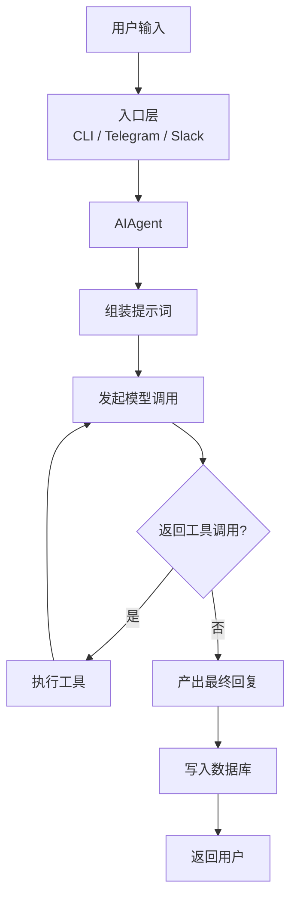

# Show, Don't Tell：信息可视化呈现准则

用结构说话，不要用段落堆砌。能用表格的不写段落，能用代码块的不描述代码。

## 核心原则

### 1. 结构化信息必须可视化

当回复中包含对比、列举、步骤、配置、参数等结构化信息时，必须用对应的可视化格式。纯文字描述结构化信息是信息表达的降级。

### 2. 选对格式，不要滥用

不是所有内容都适合可视化。纯解释性文字、因果推理、观点论证——这些用自然段落更好。可视化是为了帮助扫描和对比，不是为了好看。

### 3. 先给结构，再补说明

如果一段回复既有结构化数据又有解释文字，先给表格/列表/代码块，再在下面用 1-2 句话补充必要说明。不要把解释嵌在表格前面当铺垫。

---

## 六种场景对照表

| 信号 | 说明 | 应该用的格式 |
|------|------|-------------|
| 对比 A 和 B | 两个以上选项的优劣、差异、区别 | **表格**，列是选项，行是维度 |
| 多个属性/字段 | 参数列表、API 字段、配置项、特征 | **表格**，每行一个属性 |
| 有先后的步骤 | 操作流程、排查思路、安装步骤 | **编号列表**，每步一行，关键命令用代码块 |
| 层级/分类 | 目录结构、分类体系 | **树形结构**或缩进列表 |
| 流程/架构/关系 | 系统架构、数据流、状态机、调用链、模块关系 | **Mermaid 代码块**（flowchart / graph / sequence / classDiagram 等） |
| 代码相关 | 用法示例、配置文件、CLI 命令、SQL | **代码块**，标注语言 |
| 正反对比 | 好的写法 vs 坏的写法、推荐 vs 不推荐 | **❌/✅ 并排对比**或两个代码块 |

---

## 对比示范

### 示范 1：对比场景 — 文字堆砌 vs 表格

**用户问：** "Redis 和 Memcached 有什么区别？"

❌ 纯文字：
> Redis 支持多种数据结构，包括字符串、列表、哈希、集合和有序集合，而 Memcached 只支持简单的键值对。Redis 支持数据持久化，可以把数据存到磁盘，Memcached 不支持持久化，重启后数据丢失。Redis 是单线程模型，Memcached 是多线程模型。Redis 支持发布订阅、Lua 脚本、事务等高级功能，Memcached 功能比较简单。内存管理方面，Redis 使用自己的内存分配器，Memcached 使用 slab 分配。

✅ 表格：

| 维度 | Redis | Memcached |
|------|-------|-----------|
| 数据结构 | string / list / hash / set / zset | 仅 key-value |
| 持久化 | 支持（RDB / AOF） | 不支持 |
| 线程模型 | 单线程（6.0 起 IO 多线程） | 多线程 |
| 高级功能 | pub/sub、Lua、事务 | 无 |
| 内存管理 | 自有分配器 | slab 分配 |

一眼就能对比，不用逐句读。

### 示范 2：步骤场景 — 混在段落里 vs 编号列表

**用户问：** "怎么在 Ubuntu 上安装 Nginx？"

❌ 纯文字：
> 首先你需要更新系统的包列表，可以用 apt update 命令。然后安装 Nginx，用 apt install nginx 就可以了。安装完成后启动 Nginx 服务，用 systemctl start nginx。你还可以设置开机自启，用 systemctl enable nginx。最后验证一下是否成功，在浏览器访问服务器 IP 即可。

✅ 编号列表 + 代码块：

1. 更新包列表
   ```bash
   sudo apt update
   ```
2. 安装 Nginx
   ```bash
   sudo apt install nginx
   ```
3. 启动并设置开机自启
   ```bash
   sudo systemctl start nginx
   sudo systemctl enable nginx
   ```
4. 验证：浏览器访问 `http://<服务器IP>`，看到 Nginx 欢迎页即成功

### 示范 3：架构场景 — 段落描述 vs 树形结构

**用户问：** "这个项目的目录结构是怎样的？"

❌ 纯文字：
> src 目录下有 components、pages、utils 和 styles 四个子目录。components 里放公共组件，pages 里放页面组件，utils 里放工具函数，styles 里放全局样式。项目根目录下还有 public 目录放静态资源，以及配置文件。

✅ 树形结构：

```
project/
├── src/
│   ├── components/    # 公共组件
│   ├── pages/         # 页面组件
│   ├── utils/         # 工具函数
│   └── styles/        # 全局样式
├── public/            # 静态资源
├── package.json
└── tsconfig.json
```

### 示范 4：流程/架构场景 — 纯文本伪图 vs Mermaid

**用户问：** "请求从用户发出到返回响应经过哪些环节？"

❌ 纯文本缩进伪图：
```text
用户输入
→ 入口层 (CLI / Telegram / Slack)
→ AIAgent
  → 组装提示词
  → 发起模型调用
  → 如果返回工具调用
    → 执行工具
    → 继续下一轮
  → 产出最终回复
→ 写入数据库
→ 返回用户
```

✅ Mermaid 流程图（可被终端/编辑器渲染）：


**区别**：Mermaid 会被 Codex 终端渲染为可视化图表，纯文本缩进只是假装像个图。流程、架构、状态机、调用链、数据流这类场景，优先用 Mermaid。

### 示范 5：正反对比 — 连续段落 vs 并排对比

**用户问：** "async/await 和 .then 链哪个好？"

❌ 纯文字：
> async/await 写起来更像同步代码，可读性好。.then 链在多层嵌套时容易变成回调地狱。错误处理方面 async/await 用 try/catch，.then 用 .catch。

✅ 并排代码块：

```js
// ❌ .then 链 — 嵌套深、难读
fetch('/api/user')
  .then(res => res.json())
  .then(user => fetch(`/api/posts/${user.id}`))
  .then(res => res.json())
  .then(posts => console.log(posts))
  .catch(err => console.error(err));
```

```js
// ✅ async/await — 扁平、易读
try {
  const res = await fetch('/api/user');
  const user = await res.json();
  const postsRes = await fetch(`/api/posts/${user.id}`);
  const posts = await postsRes.json();
  console.log(posts);
} catch (err) {
  console.error(err);
}
```

---

## 输出前自检

生成回复时，逐条检查：

1. **对比检测**：回复里有没有在对比两个以上的东西？有 → 用表格。
2. **列举检测**：回复里有没有列举多个属性/参数/特征？有 → 用表格或列表。
3. **步骤检测**：回复里有没有描述分步骤的操作？有 → 用编号列表 + 代码块。
4. **代码检测**：回复里有没有提到具体的命令/代码/配置？有 → 用代码块，不要内联描述。
5. **结构检测**：回复里有没有描述层级/目录？有 → 用树形结构。
6. **流程/架构检测**：回复里有没有描述流程、架构、调用链、状态流转？有 → 用 Mermaid 代码块，不要用纯文本箭头缩进。

---

## 边界说明

以下情况不需要强制可视化：

- **纯观点/解释**：比如"为什么 React 比 jQuery 好"这种论述性回答，自然段落更好
- **很短的回答**：一两句话能说清的事不需要表格
- **用户明确要求格式**：比如"用纯文字回答"
- **对话/闲聊场景**：非技术性的日常对话
